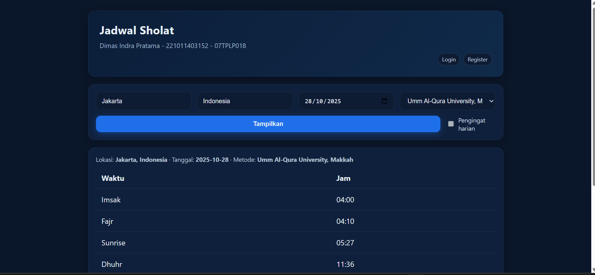
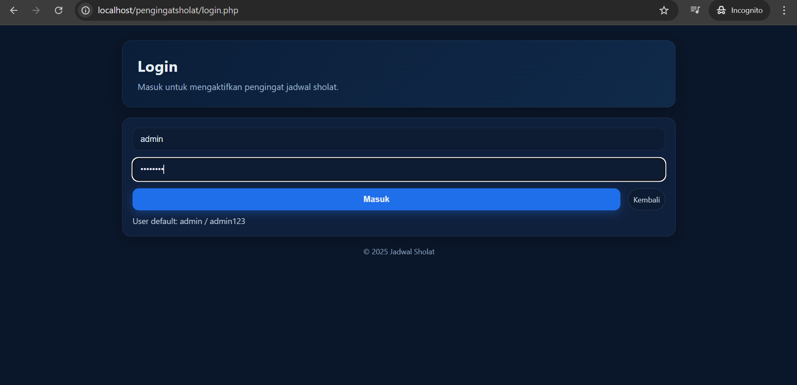

# Pengingat Sholat (Jadwal Sholat)

Aplikasi web sederhana untuk menampilkan jadwal sholat per kota/negara, menyimpan hasilnya ke database, serta menyediakan fitur pengingat lokal (notifikasi + bunyi) di browser. Aplikasi ini juga memiliki sistem autentikasi (login/register) dengan dukungan role dan halaman CMS khusus admin untuk mengelola informasi yang tampil di halaman utama.

## Fitur Utama
- Jadwal sholat berdasarkan kota, negara, tanggal, dan metode perhitungan.
- Penyimpanan jadwal ke database (mengurangi panggilan API untuk tanggal/lokasi yang sama).
- Pengingat lokal di browser (notifikasi + bunyi singkat) untuk waktu sholat hari itu.
- Autentikasi: register, login, logout.
- Role user:
  - user: default saat register.
  - admin: memiliki akses ke halaman CMS untuk mengubah informasi di beranda.
- CMS admin: edit konten “Informasi” yang tampil di halaman index.

## Teknologi
- PHP 8+ (PDO MySQL)
- MySQL/MariaDB
- HTML/CSS (tanpa framework berat)
- API jadwal sholat: Aladhan (melalui `lib/api.php`)

## Struktur Proyek (ringkas)
- `index.php` — Halaman utama, form pencarian jadwal, tampilan hasil, kartu Informasi.
- `login.php`, `register.php`, `logout.php` — Autentikasi.
- `cms.php` — Halaman CMS (khusus admin) untuk mengelola Informasi.
- `lib/` — Kode pendukung:
  - `db.php` — Koneksi DB, schema/migrasi sederhana, helper penyimpanan & site info.
  - `auth.php` — Session & helper autentikasi (termasuk role).
  - `api.php` — Akses API Aladhan & utilitas terkait.
- `assets/styles.css` — Gaya tampilan sederhana.
- `config.php` — Konfigurasi DB & timezone.
- `schema.sql` — Skrip SQL opsional bila ingin setup manual.

## Persiapan & Instalasi
1. Pastikan PHP dan MySQL/MariaDB tersedia. Skenario lokal yang umum: XAMPP
   - MySQL host: `localhost`
   - User: `root`
   - Password: (kosong)
2. Clone/salin project ini ke folder web server Anda (mis. `htdocs/pengingatsholat`).
3. Konfigurasi `config.php` bila perlu:
   - `DB_HOST`, `DB_NAME`, `DB_USER`, `DB_PASS`
   - `APP_TIMEZONE` (default `Asia/Jakarta`).
4. Buat database dan tabel:
   - Cara 1 (otomatis): aplikasi akan membuat/memigrasikan schema saat dibuka pertama kali.
   - Cara 2 (manual): jalankan `schema.sql` di MySQL.
5. Jalankan server lokal (mis. XAMPP Apache) dan buka di browser:
   - `http://localhost/pengingatsholat/`

Saat pertama kali berjalan, sistem akan membuat akun admin default:
- Username: `admin`
- Password: `admin123`

Anda dapat mengubah password admin langsung di database atau dengan membuat akun baru dan mempromosikannya menjadi admin (lihat bagian Role).

## Cara Pakai
1. Buka `index.php`.
2. Isi kota, negara, tanggal, dan metode perhitungan. Klik Tampilkan.
3. Jika ingin pengingat jadwal (notifikasi + bunyi), login terlebih dahulu lalu centang “Pengingat harian”.
4. Anda bisa Register untuk membuat akun baru. Role default adalah `user`.
5. Login sebagai admin untuk mengelola Informasi:
   - Klik menu “CMS” di kanan atas (muncul hanya untuk admin).
   - Edit konten pada halaman `cms.php`, klik Simpan.
   - Konten akan tampil di kartu “Informasi” di `index.php`.

## Screenshoot Apikasi ini

Halaman Utama:



Halaman Login:



## Role & Hak Akses
- `user` (default):
  - Bisa mencari & melihat jadwal.
  - Bisa mengaktifkan pengingat di browser (perlu login untuk hak notifikasi terkelola).
- `admin`:
  - Semua hak `user`.
  - Akses ke `cms.php` untuk mengelola konten Informasi.

Mengubah role user menjadi admin (SQL contoh):
```sql
UPDATE users SET role = 'admin' WHERE username = 'nama_user';
```

## Catatan Pengingat (Browser)
- Notifikasi berjalan di sisi klien (browser). Tab harus terbuka minimal saat penjadwalan dibuat.
- Browser akan meminta izin notifikasi. Setujui agar notifikasi muncul.
- Pengingat menggunakan `setTimeout` untuk waktu pada tanggal yang dipilih.

## Troubleshooting
- Tidak bisa konek DB (PDO):
  - Pastikan ekstensi PDO MySQL aktif.
  - Cek `config.php` (host, nama DB, kredensial).
  - Pastikan DB sudah dibuat (otomatis/`schema.sql`).
- Tidak ada jadwal/hasil kosong:
  - Pastikan kota/negara valid.
  - Coba metode perhitungan lain.
  - Cek koneksi internet (untuk panggilan API pertama kali).
- Notifikasi tidak muncul:
  - Periksa izin notifikasi di browser.
  - Pastikan sudah login dan opsi pengingat dicentang.

